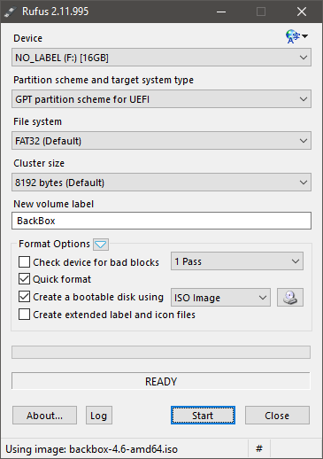
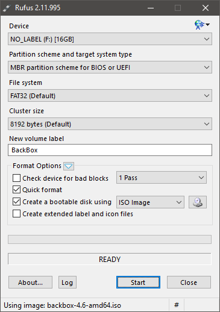

# BackBox Live USB with persistence
This should also work for any Live USB with persistence, but I haven't tested it.  
Rufus have not built-in persistence creation support, but you can use it to create a bootable live flashdrive, and then manually add peristence. __Steps 01, 02, 03, 05__ are done on Windows (`Windows 10×64, GPT, UEFI` in my case), __step 04__ is done on Linux distro (`Fedora 24×64, GPT, UEFI` in my case), __step 06__ is done on Live USB created in previous steps.

## Step 01: Download files
- Download latest [BackBox ISO](https://backbox.org/download).
- Download latest version of [Rufus](https://rufus.akeo.ie/#download).

## Step 02: Create Bootable USB using [Rufus](https://rufus.akeo.ie).
01. Right click Rufus exacutable and choos "Run as Administrator" from context menu.
02. Under "Device", choose your flash-drive (if it's the only visible drive, it will already be choosen) as the device to be used.
03. Under "Partition scheme and target system type", choose "GPT partition scheme for UEFI" as the partition table type to use, for older devices you can choose "MBR partition scheme for BIOS or UEFI".
04. Under "File system", choose "FAT32" as the filesystem to use.
05. Format options: uncheck "Check device for bad blocks", check "Quick format", check "Create a bootable disk using", choose "ISO image" and click button beside the dropdown to browse for ISO to be used when creating the bootable disk, uncheck "Create extened label and icon files".
06. Under "New volume label", enter your desired label (ie. "BackBox").
07. Click "Start", when the warning message pops up, take one last moment to make sure for sure Rufus is saying it will write to the flash-drive you desire, and then click "OK" to proceed.
08. When USB creation is finished (the progress bar above the word 'READY' will be filled), click "Close" to exit Rufus.

### Rufus options for _GPT for UEFI_ and _MBR for BIOS or UEFI_




## Step 03: Edit menuentries
__DO NOT__ use default Windows Notepad - it will most probably mess up with your files. Download [Atom](https://atom.io/), [Sublime Text](https://www.sublimetext.com/3) or [Notepad++](https://notepad-plus-plus.org/download) and use one of them to edit the files.  
__Note__: If you have chosen "MBR partition scheme for BIOS or UEFI", menuentries content may be slightly different, so __do not just copy and paste the code below__.

### Edit `/boot/grub/grub.cfg`
Add the first entry `Start BackBox in Persistent Mode`, add second entry `Start BackBox in Forensic Mode` and change the third entry `Try BackBox without installing` to `Start BackBox`. The essential part is adding the word `persistent` in the first entry after `boot=casper` (absence of this option is the reason why persistence doesn't work in UEFI mode).  
In other words your three first menuentries should look like that:

```
menuentry "Start BackBox in Persistent Mode" {
	set gfxpayload=keep
	linux	/casper/vmlinuz.efi  file=/cdrom/preseed/backbox.seed boot=casper persistent quiet splash --
	initrd	/casper/initrd.gz
}
menuentry "Start BackBox in Forensic Mode" {
	set gfxpayload=keep
	linux	/casper/vmlinuz.efi  file=/cdrom/preseed/backbox.seed boot=casper quiet splash --
	initrd	/casper/initrd_forensic.gz
}
menuentry "Start BackBox" {
	set gfxpayload=keep
	linux	/casper/vmlinuz.efi  file=/cdrom/preseed/backbox.seed boot=casper quiet splash --
	initrd	/casper/initrd.gz
}
```

### Edit `/isolinux/isolinux.cfg`
Find `Try BackBox without installing` and change it to `Start BackBox`.

## Step 04: Create `casper-rw`
01. Boot to your Linux distro and open Terminal.
02. Type `sudo parted -l` to locate your device node name for Windows partition (ie. `/dev/sda4`).
03. Type `sudo mkdir /media/Windows`.
04. Type `sudo mount /dev/sda4 /media/Windows` (substitute `sda4` for your Windows partition).
05. Type `sudo -i`, then type `dd if=/dev/zero of=/media/Windows/casper-rw bs=1M count=4095`. If your flash drive is smaller than 6 GB then you'll need to use a smaller count, as this count creates a file that is 1 MB smaller than 4 GB. You cannot create a larger file, even if your drive has enough space, because fat32 filesystem has a file size limit of 4 GB minus 1 MB.
06. Type "exit", then type `mkfs -t ext4 /media/Windows/casper-rw`, and if/when prompted to proceed despite the file not being a block-device, type `y`, and press `enter`.

## Step 05: Copy `casper-rw` to bootable USB.
Boot Windows and browse to your `C:` drive. Copy `casper-rw` to the your bootable flash drive main directory. You can now delete the one from the `C:` drive.

## Step 06: Tweaks
__Important__: this step is crucial to be able to use your persistent live system. __Do not__ fiddle around with other things, it will most likely leave your installation unusable. __NEVER DO__ dist-upgrades and/or bad attempts to clean up folders.

01. Boot to live media.
02. In the settings menu head to the "Users and groups" category, create a new user (choose account type "administrator" and set password, go to advanced settings/user priviliges and check all boxes). __Logout and do not reboot.__
03. Log in again (as user you have created in previous step), head to file manager and click filesystem. Select `Home`, right click "Open folder as root", select `backbox` folder and do a right click -> `secure delete`. The folder will be rewritten, just kicking out the default user and ensuring you are able to login to your created account. If you don't, backbox will always login the default (backbox) user, without asking for credentials. __Important__: you can not erase the default user account, it won't appear selectable! Anyways, just erasing its home folder is enough.

---

#### Credits
Some informations are taken/copied from the links below.
- [Easy way to setup persistent Backbox Live Medium (Mac supported!)](http://bit.ly/2eFC2FH)
- [Rufus + Win + UEFI + Persistent Live flashdrive](http://bit.ly/2eFC6oV)

#### Licence
[MIT License](https://opensource.org/licenses/MIT)  
Copyright © 2016 [TMMC](http://www.tmmc.pl)
